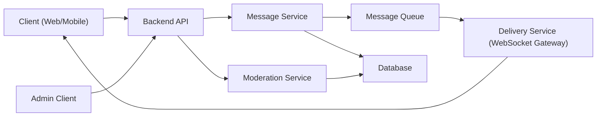

<div align="center">

# Міністерство освіти і науки України  
## Київський авіаційний інститут  
### Факультет кібербезпеки, комп’ютерної та програмної інженерії  
### Кафедра інженерії програмного забезпечення  

<br>

# ЛАБОРАТОРНА РОБОТА №1  
## з дисципліни  
### «Конструювання та документування програмного забезпечення»

<br>

**Виконав:** студент гр. ПІ-121:2  
**Івашко Іван Андрійович**

<br>

**Прийняв:**  
Роман Ігорович Малькевич  

<br>

**КИЇВ 2026**

</div>

---

# 🧪 Laboratory Work 1  
## Designing a Messaging System  

---

## 🎯 Goal

Learn how to:

- design software systems before coding  
- reason about architecture and responsibilities  
- use Component, Sequence, and State diagrams  
- document decisions using RFC and ADR  

---

## 🧠 Context

You are designing a **minimal messenger system** that supports:

- sending messages between users  
- asynchronous delivery  
- message statuses (sent / delivered / read)  
- offline users  

No code is required. You act as a **system designer / tech lead**.

---

## 🧩 Functional Requirements

1. A user can send a message to another user.  
2. Each message has a lifecycle.  
3. The system must:
   - store messages  
   - deliver them asynchronously  
   - update delivery status  
4. The recipient may be online or offline.  

---

# 🧪 Selected Variant

## 🔹 Variant 4 — Group Chat

**Focus:** scaling delivery logic  

### Additional requirements:

- Messages sent to multiple recipients  
- Separate delivery status per recipient  

### Key questions:

- Fan-out strategy  
- Performance implications  


# 🧱 Part 1 — Component Diagram (Production Architecture)



---
---

# 🖥 Messenger Maks — Local Implementation

## 🧠 Implementation Overview

The implemented version of Messenger Maks is a simplified local simulation of the designed architecture.

Differences from production architecture:

- No backend server
- No authentication
- No database
- No message queue
- Instant message delivery
- All logic runs in browser (JavaScript)

Each user is represented by a separate browser window.

Admin is also a separate window with read-only access.

---

## 👥 Users in the System

The system simulates:

- User1
- User2
- User3
- Admin

Each user opens the application in a separate window.

Authentication is not required.  
Opening a new window equals login.

---

## 🧱 Simplified Component Diagram (Local Version)

```mermaid
flowchart LR

U1["User1"]
U2["User2"]
U3["User3"]
GR["Group Chat"]
Admin["Admin Window"]
SN["Send messege"]
MS["Messege server Data"]
EV[New messege event]
CH["Can I read it ?"]
U1-->SN
U2-->SN
U3-->SN
SN-->MS
MS-->EV
EV-->Admin
EV-->GR
EV-->CH
CH-->U1
CH-->U2
CH-->U3
GR-->U1
GR-->U2
GR-->U3
GR-->Admin
