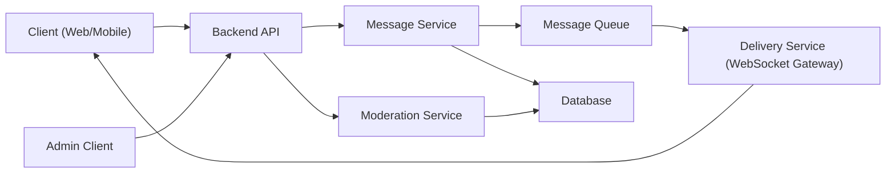
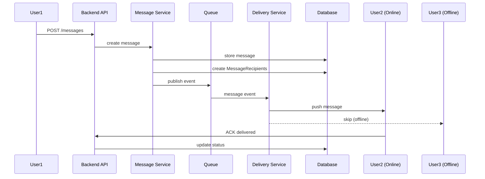
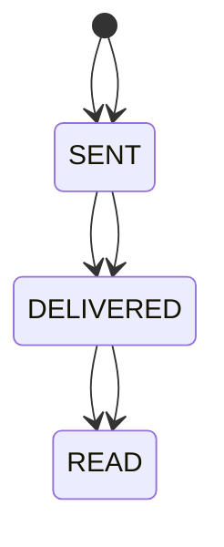
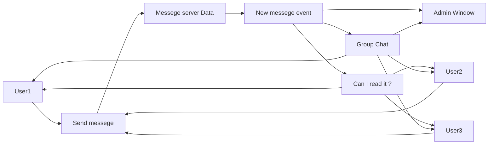

# Міністерство освіти і науки України  
## Київський авіаційний інститут  
### Факультет кібербезпеки, комп’ютерної та програмної інженерії  
### Кафедра інженерії програмного забезпечення  

 

# ЛАБОРАТОРНА РОБОТА №1  
## з дисципліни  
### «Конструювання та документування програмного забезпечення»

 

**Виконав:** студент гр. ПІ-121:2  
**Івашко Іван Андрійович**

 

**Прийняв:**  
Роман Ігорович Малькевич  

 

**КИЇВ 2026**

---

# 🧪 Laboratory Work 1  
## Designing a Messaging System  

---

## 🎯 Goal

Learn how to:

- design software systems before coding  
- reason about architecture and responsibilities  
- use Component, Sequence, and State diagrams  
- document decisions using RFC and ADR  

---

## 🧠 Context

You are designing a **minimal messenger system** that supports:

- sending messages between users  
- asynchronous delivery  
- message statuses (sent / delivered / read)  
- offline users  

No code is required. You act as a **system designer / tech lead**.

---

## 🧩 Functional Requirements

1. A user can send a message to another user.  
2. Each message has a lifecycle.  
3. The system must:
   - store messages  
   - deliver them asynchronously  
   - update delivery status  
4. The recipient may be online or offline.  

---

# 🧪 Selected Variant

## 🔹 Variant 4 — Group Chat

**Focus:** scaling delivery logic  

### Additional requirements:

- Messages sent to multiple recipients  
- Separate delivery status per recipient  

### Key questions:

- Fan-out strategy  
- Performance implications  

# 🧱 Part 1 — Component Diagram (Production Architecture)

---
---
## Part 2 — Sequence Diagram  
### Scenario: User sends message to group, one user offline

---
🔄 Part 3 — State Diagram
Entity: MessageRecipient

---
📚 Part 4 — ADR
ADR-001: Separate MessageRecipient for Group Delivery
Status

Accepted

Context

Group chats require independent delivery tracking per participant.

Decision

Introduce a separate MessageRecipient entity with its own lifecycle state.

Alternatives

Single status in Message (rejected)

Store statuses as JSON in Message (rejected)

Consequences

Independent read tracking

Scales for large groups

Increased schema complexity
Pros of Designed Production Model

Proper separation of concerns

Independent services

Scalable delivery mechanism

Asynchronous communication

Per-recipient status tracking

Admin isolation layer

Clear lifecycle modeling

Expandable to file transfer

Expandable to encryption

Expandable to moderation logic

Suitable for distributed deployment

Industry-aligned architecture

Queue-based resilience potential

Supports horizontal scaling

Supports fault tolerance (conceptually)

Suitable for microservice evolution

Cons of Designed but Not Implemented Production Model:
-Not implemented in real infrastructure

-No real message queue configured

-No actual WebSocket server

-No real database schema migration

-No performance benchmarking

-No load testing

-No monitoring tools configured

-No observability stack

-No containerization defined

-No deployment pipeline

-No infrastructure as code

-No real authentication provider

-No token management

-No encryption layer implemented

-No real retry mechanism tested

-No dead-letter queue configured

-No failure simulation

-No rollback strategy

-No horizontal scaling validation

-No security audit

-No penetration testing

-No API rate limit enforcement

-No real multi-instance behavior

-No consistency guarantees validated

-No SLA definition

-No cost estimation

-No cloud provider configuration

-No distributed tracing

-No caching layer

-No indexing strategy verified

-No data retention policy implemented

-No GDPR compliance validation

-No production logging format

-No backup automation

Additional Design: Admin Observer
Admin Capabilities

Can view all chats

Can view user notes

Not included in read receipts

Cannot send messages

Implementation Principle

Admin is not a ChatParticipant.
Admin has read-only access through a separate Moderation layer.

#  Messenger Maks — Local Implementation

## Implementation Overview

The implemented version of Messenger Maks is a simplified local simulation of the designed architecture.

Differences from production architecture:

- No authentication
- No database
- No message queue
- Instant message delivery

Each user is represented by a separate browser window.

Admin is also a separate window with read-only access.

---

##  Users in the System

The system simulates:

- User1
- User2
- User3
- -Group Chat
- Admin

Each user opens the application in a separate window.

Authentication is not required.  
Opening a new window equals login.

---

##  Simplified Component Diagram (Local Version)

---
Pros of this architecture:

- Easy to code
  
- Simple and easy to understand
  
- Fast to develop
  
- Work without wifi conection
- 
-Open-source

-Minimal architectural complexity

-No infrastructure required

-No hosting cost

-No dependency on network

-Deterministic behavior

-Ideal for demonstration

-Easy to debug

-Easy to extend

-Clear separation between windows (role simulation)

-Demonstrates event-driven thinking

-Shows understanding of multi-user interaction logic

-Fully controllable environment

-No external failure points

-Good educational prototype

-Demonstrates architectural awareness even in simplified form

#Cons of architecture and realization:

-Can't actually function as messenger

-Works locally only on one device

-No data saves

-Can't transfer files

-NO privacy

-No safety (but also the safest "messenger" since no password required and no user data send to other devices)

-log-in without password (for best)

-Works only on PC

-no pfp

-no messege nor user search

-No session handling

-No encryption

-No backend separation

-No offline handling logic

-No true asynchronous processing

-No scalability

-No concurrency protection

-No rate limiting

-No role-based access control

-Admin privileges are UI-based, not system-enforced

-No error handling strategy

-No input validation

-No message size limitation

-No spam protection

-No API layer

-No architectural boundaries

-No separation of concerns
-No test coverage
-No CI/CD

-No deployment model

-No resilience strategy

-No disaster recovery

-No message editing

-No message deletion

-No audit trail
